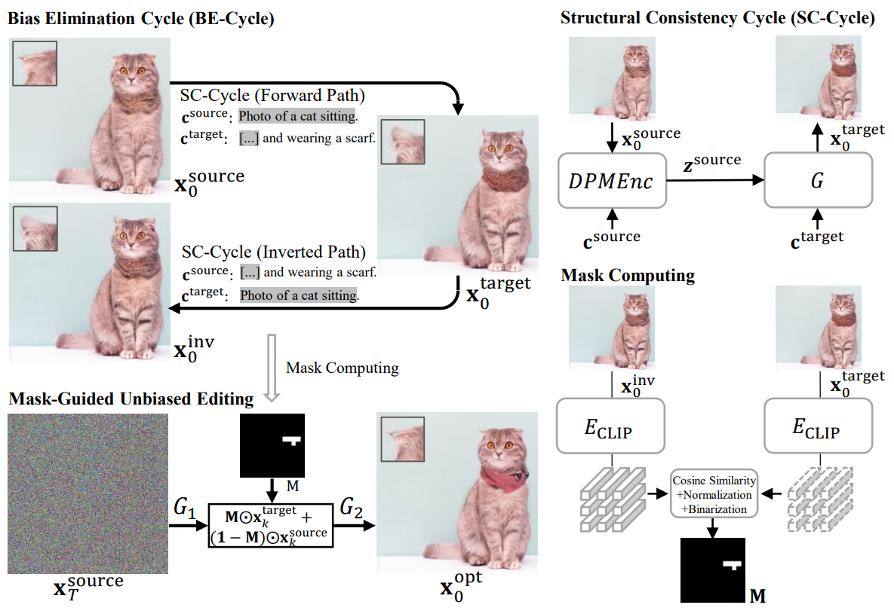

# Eliminating Contextual Prior Bias for Semantic Image Editing via Dual-Cycle Diffusion

Official PyTorch implementation
Chen Henry Wu, Fernando De la Torre <br>
Zuopeng Yang, Tianshu Chu, Xin Lin, Erdun Gao, Daqing Liu, Jie Yang, Chaoyue Wang

The paper has been accepted by the IEEE Transactions on Circuits and Systems for Video Technology (TCSVT)

[**[Paper link]**](https://ieeexplore.ieee.org/document/10154005) 

## Notes
The code is based on [cycle-diffusion](https://github.com/ChenWu98/cycle-diffusion).

## Overview
The recent success of text-to-image generation diffusion models has also revolutionized semantic image editing, enabling the manipulation of images based on query/target texts. Despite these advancements, a significant challenge lies in the potential introduction of contextual prior bias in pre-trained models during image editing, \textit{e.g.}, making unexpected modifications to inappropriate regions. To address this issue, we present a novel approach called Dual-Cycle Diffusion, which generates an unbiased mask to guide image editing.

We used [Stable Diffusion](https://github.com/CompVis/stable-diffusion) in our experiments. 

<div align=center>
    
</div>

<br>

Here are some comparisons with baselines. 

<div align=center>
    
</div>


## Dependencies

1. Create environment by running
```shell
conda env create -f environment.yml
conda activate dualcycle
pip install git+https://github.com/openai/CLIP.git
```
2. Install `torch` and `torchvision` based on your CUDA version. 
3. Install [taming-transformers](https://github.com/CompVis/taming-transformers) by running
```shell
cd ../
git clone git@github.com:CompVis/taming-transformers.git
cd taming-transformers/
pip install -e .
cd ../
```
4. Set up [wandb](https://wandb.ai/) for logging (registration is required). You should modify the ```setup_wandb``` function in ```main.py``` to accomodate your wandb credentials. You may want to run something like
```shell
wandb login
```

## Evaluation data

The evaluation data for zero-shot image-to-image translation are already included in [data/](data/). 

## Pre-trained diffusion models

1. Stable Diffusion
```shell
cd ckpts/
mkdir stable_diffusion
cd stable_diffusion/
# Download pre-trained checkpoints for Stable Diffusion here.
# You should download this version: https://huggingface.co/CompVis/stable-diffusion-v-1-4-original
# Due to licence issues, we cannot share the pre-trained checkpoints directly.
```
2. Latent Diffusion Model
```shell
cd ckpts/
cd ckpts/
wget https://www.dropbox.com/s/9lpdgs83l7tjk6c/ldm_models.zip
unzip ldm_models.zip
cd ldm_models/
mkdir text2img-large
cd text2img-large/
wget https://ommer-lab.com/files/latent-diffusion/nitro/txt2img-f8-large/model.ckpt
wget https://www.dropbox.com/s/7pdttimz78ll0km/txt2img-1p4B-eval.yaml
```

## Usage

### Zero-shot image-to-image translation with text-to-image diffusion models
1. Zero-shot image-to-image translation with Stable Diffusion v1-4. We divided the 128 test samples into 8 groups (16 samples in each group), so the averaged metrics are reported. 
```shell
export CUDA_VISIBLE_DEVICES=0
export RUN_NAME=dual_cycle_sd_v14_1
export SEED=42
nohup python -m torch.distributed.launch --nproc_per_node 1 --master_port 1405 main.py --seed $SEED --cfg experiments/$RUN_NAME.cfg --run_name $RUN_NAME$SEED --logging_strategy steps --logging_first_step true --logging_steps 4 --evaluation_strategy steps --eval_steps 50 --metric_for_best_model CLIPEnergy --greater_is_better false --save_strategy steps --save_steps 50 --save_total_limit 1 --load_best_model_at_end --gradient_accumulation_steps 4 --num_train_epochs 0 --adafactor false --learning_rate 1e-3 --do_eval --output_dir output/$RUN_NAME$SEED --overwrite_output_dir --per_device_train_batch_size 1 --per_device_eval_batch_size 4 --eval_accumulation_steps 4 --ddp_find_unused_parameters true --verbose true > $RUN_NAME$SEED.log 2>&1 &

export CUDA_VISIBLE_DEVICES=1
export RUN_NAME=dual_cycle_sd_v14_2
export SEED=42
nohup python -m torch.distributed.launch --nproc_per_node 1 --master_port 1424 main.py --seed $SEED --cfg experiments/$RUN_NAME.cfg --run_name $RUN_NAME$SEED --logging_strategy steps --logging_first_step true --logging_steps 4 --evaluation_strategy steps --eval_steps 50 --metric_for_best_model CLIPEnergy --greater_is_better false --save_strategy steps --save_steps 50 --save_total_limit 1 --load_best_model_at_end --gradient_accumulation_steps 4 --num_train_epochs 0 --adafactor false --learning_rate 1e-3 --do_eval --output_dir output/$RUN_NAME$SEED --overwrite_output_dir --per_device_train_batch_size 1 --per_device_eval_batch_size 4 --eval_accumulation_steps 4 --ddp_find_unused_parameters true --verbose true > $RUN_NAME$SEED.log 2>&1 &

export CUDA_VISIBLE_DEVICES=2
export RUN_NAME=dual_cycle_sd_v14_3
export SEED=42
nohup python -m torch.distributed.launch --nproc_per_node 1 --master_port 1423 main.py --seed $SEED --cfg experiments/$RUN_NAME.cfg --run_name $RUN_NAME$SEED --logging_strategy steps --logging_first_step true --logging_steps 4 --evaluation_strategy steps --eval_steps 50 --metric_for_best_model CLIPEnergy --greater_is_better false --save_strategy steps --save_steps 50 --save_total_limit 1 --load_best_model_at_end --gradient_accumulation_steps 4 --num_train_epochs 0 --adafactor false --learning_rate 1e-3 --do_eval --output_dir output/$RUN_NAME$SEED --overwrite_output_dir --per_device_train_batch_size 1 --per_device_eval_batch_size 4 --eval_accumulation_steps 4 --ddp_find_unused_parameters true --verbose true > $RUN_NAME$SEED.log 2>&1 &

export CUDA_VISIBLE_DEVICES=3
export RUN_NAME=dual_cycle_sd_v14_4
export SEED=42
nohup python -m torch.distributed.launch --nproc_per_node 1 --master_port 1422 main.py --seed $SEED --cfg experiments/$RUN_NAME.cfg --run_name $RUN_NAME$SEED --logging_strategy steps --logging_first_step true --logging_steps 4 --evaluation_strategy steps --eval_steps 50 --metric_for_best_model CLIPEnergy --greater_is_better false --save_strategy steps --save_steps 50 --save_total_limit 1 --load_best_model_at_end --gradient_accumulation_steps 4 --num_train_epochs 0 --adafactor false --learning_rate 1e-3 --do_eval --output_dir output/$RUN_NAME$SEED --overwrite_output_dir --per_device_train_batch_size 1 --per_device_eval_batch_size 4 --eval_accumulation_steps 4 --ddp_find_unused_parameters true --verbose true > $RUN_NAME$SEED.log 2>&1 &

export CUDA_VISIBLE_DEVICES=4
export RUN_NAME=dual_cycle_sd_v14_5
export SEED=42
nohup python -m torch.distributed.launch --nproc_per_node 1 --master_port 1429 main.py --seed $SEED --cfg experiments/$RUN_NAME.cfg --run_name $RUN_NAME$SEED --logging_strategy steps --logging_first_step true --logging_steps 4 --evaluation_strategy steps --eval_steps 50 --metric_for_best_model CLIPEnergy --greater_is_better false --save_strategy steps --save_steps 50 --save_total_limit 1 --load_best_model_at_end --gradient_accumulation_steps 4 --num_train_epochs 0 --adafactor false --learning_rate 1e-3 --do_eval --output_dir output/$RUN_NAME$SEED --overwrite_output_dir --per_device_train_batch_size 1 --per_device_eval_batch_size 4 --eval_accumulation_steps 4 --ddp_find_unused_parameters true --verbose true > $RUN_NAME$SEED.log 2>&1 &

export CUDA_VISIBLE_DEVICES=5
export RUN_NAME=dual_cycle_sd_v14_6
export SEED=42
nohup python -m torch.distributed.launch --nproc_per_node 1 --master_port 1428 main.py --seed $SEED --cfg experiments/$RUN_NAME.cfg --run_name $RUN_NAME$SEED --logging_strategy steps --logging_first_step true --logging_steps 4 --evaluation_strategy steps --eval_steps 50 --metric_for_best_model CLIPEnergy --greater_is_better false --save_strategy steps --save_steps 50 --save_total_limit 1 --load_best_model_at_end --gradient_accumulation_steps 4 --num_train_epochs 0 --adafactor false --learning_rate 1e-3 --do_eval --output_dir output/$RUN_NAME$SEED --overwrite_output_dir --per_device_train_batch_size 1 --per_device_eval_batch_size 4 --eval_accumulation_steps 4 --ddp_find_unused_parameters true --verbose true > $RUN_NAME$SEED.log 2>&1 &

export CUDA_VISIBLE_DEVICES=6
export RUN_NAME=dual_cycle_sd_v14_7
export SEED=42
nohup python -m torch.distributed.launch --nproc_per_node 1 --master_port 1427 main.py --seed $SEED --cfg experiments/$RUN_NAME.cfg --run_name $RUN_NAME$SEED --logging_strategy steps --logging_first_step true --logging_steps 4 --evaluation_strategy steps --eval_steps 50 --metric_for_best_model CLIPEnergy --greater_is_better false --save_strategy steps --save_steps 50 --save_total_limit 1 --load_best_model_at_end --gradient_accumulation_steps 4 --num_train_epochs 0 --adafactor false --learning_rate 1e-3 --do_eval --output_dir output/$RUN_NAME$SEED --overwrite_output_dir --per_device_train_batch_size 1 --per_device_eval_batch_size 4 --eval_accumulation_steps 4 --ddp_find_unused_parameters true --verbose true > $RUN_NAME$SEED.log 2>&1 &

export CUDA_VISIBLE_DEVICES=7
export RUN_NAME=dual_cycle_sd_v14_8
export SEED=42
nohup python -m torch.distributed.launch --nproc_per_node 1 --master_port 1426 main.py --seed $SEED --cfg experiments/$RUN_NAME.cfg --run_name $RUN_NAME$SEED --logging_strategy steps --logging_first_step true --logging_steps 4 --evaluation_strategy steps --eval_steps 50 --metric_for_best_model CLIPEnergy --greater_is_better false --save_strategy steps --save_steps 50 --save_total_limit 1 --load_best_model_at_end --gradient_accumulation_steps 4 --num_train_epochs 0 --adafactor false --learning_rate 1e-3 --do_eval --output_dir output/$RUN_NAME$SEED --overwrite_output_dir --per_device_train_batch_size 1 --per_device_eval_batch_size 4 --eval_accumulation_steps 4 --ddp_find_unused_parameters true --verbose true > $RUN_NAME$SEED.log 2>&1 &
```
2. Zero-shot image-to-image translation with the LDM text-to-image checkpoint. We divided the 128 test samples into 8 groups, so the averaged metrics are reported. 
```shell
export CUDA_VISIBLE_DEVICES=0
export RUN_NAME=dual_cycle_ldm_1
export SEED=42
nohup python -m torch.distributed.launch --nproc_per_node 1 --master_port 1465 main.py --seed $SEED --cfg experiments/$RUN_NAME.cfg --run_name $RUN_NAME$SEED --logging_strategy steps --logging_first_step true --logging_steps 4 --evaluation_strategy steps --eval_steps 50 --metric_for_best_model CLIPEnergy --greater_is_better false --save_strategy steps --save_steps 50 --save_total_limit 1 --load_best_model_at_end --gradient_accumulation_steps 4 --num_train_epochs 0 --adafactor false --learning_rate 1e-3 --do_eval --output_dir output/$RUN_NAME$SEED --overwrite_output_dir --per_device_train_batch_size 1 --per_device_eval_batch_size 16 --eval_accumulation_steps 4 --ddp_find_unused_parameters true --verbose true > $RUN_NAME$SEED.log 2>&1 &

export CUDA_VISIBLE_DEVICES=1
export RUN_NAME=dual_cycle_ldm_2
export SEED=42
nohup python -m torch.distributed.launch --nproc_per_node 1 --master_port 1485 main.py --seed $SEED --cfg experiments/$RUN_NAME.cfg --run_name $RUN_NAME$SEED --logging_strategy steps --logging_first_step true --logging_steps 4 --evaluation_strategy steps --eval_steps 50 --metric_for_best_model CLIPEnergy --greater_is_better false --save_strategy steps --save_steps 50 --save_total_limit 1 --load_best_model_at_end --gradient_accumulation_steps 4 --num_train_epochs 0 --adafactor false --learning_rate 1e-3 --do_eval --output_dir output/$RUN_NAME$SEED --overwrite_output_dir --per_device_train_batch_size 1 --per_device_eval_batch_size 16 --eval_accumulation_steps 4 --ddp_find_unused_parameters true --verbose true > $RUN_NAME$SEED.log 2>&1 &

export CUDA_VISIBLE_DEVICES=2
export RUN_NAME=dual_cycle_ldm_3
export SEED=42
nohup python -m torch.distributed.launch --nproc_per_node 1 --master_port 1486 main.py --seed $SEED --cfg experiments/$RUN_NAME.cfg --run_name $RUN_NAME$SEED --logging_strategy steps --logging_first_step true --logging_steps 4 --evaluation_strategy steps --eval_steps 50 --metric_for_best_model CLIPEnergy --greater_is_better false --save_strategy steps --save_steps 50 --save_total_limit 1 --load_best_model_at_end --gradient_accumulation_steps 4 --num_train_epochs 0 --adafactor false --learning_rate 1e-3 --do_eval --output_dir output/$RUN_NAME$SEED --overwrite_output_dir --per_device_train_batch_size 1 --per_device_eval_batch_size 16 --eval_accumulation_steps 4 --ddp_find_unused_parameters true --verbose true > $RUN_NAME$SEED.log 2>&1 &

export CUDA_VISIBLE_DEVICES=3
export RUN_NAME=dual_cycle_ldm_4
export SEED=42
nohup python -m torch.distributed.launch --nproc_per_node 1 --master_port 1487 main.py --seed $SEED --cfg experiments/$RUN_NAME.cfg --run_name $RUN_NAME$SEED --logging_strategy steps --logging_first_step true --logging_steps 4 --evaluation_strategy steps --eval_steps 50 --metric_for_best_model CLIPEnergy --greater_is_better false --save_strategy steps --save_steps 50 --save_total_limit 1 --load_best_model_at_end --gradient_accumulation_steps 4 --num_train_epochs 0 --adafactor false --learning_rate 1e-3 --do_eval --output_dir output/$RUN_NAME$SEED --overwrite_output_dir --per_device_train_batch_size 1 --per_device_eval_batch_size 16 --eval_accumulation_steps 4 --ddp_find_unused_parameters true --verbose true > $RUN_NAME$SEED.log 2>&1 &

export CUDA_VISIBLE_DEVICES=4
export RUN_NAME=dual_cycle_ldm_5
export SEED=42
nohup python -m torch.distributed.launch --nproc_per_node 1 --master_port 1488 main.py --seed $SEED --cfg experiments/$RUN_NAME.cfg --run_name $RUN_NAME$SEED --logging_strategy steps --logging_first_step true --logging_steps 4 --evaluation_strategy steps --eval_steps 50 --metric_for_best_model CLIPEnergy --greater_is_better false --save_strategy steps --save_steps 50 --save_total_limit 1 --load_best_model_at_end --gradient_accumulation_steps 4 --num_train_epochs 0 --adafactor false --learning_rate 1e-3 --do_eval --output_dir output/$RUN_NAME$SEED --overwrite_output_dir --per_device_train_batch_size 1 --per_device_eval_batch_size 16 --eval_accumulation_steps 4 --ddp_find_unused_parameters true --verbose true > $RUN_NAME$SEED.log 2>&1 &

export CUDA_VISIBLE_DEVICES=5
export RUN_NAME=dual_cycle_ldm_6
export SEED=42
nohup python -m torch.distributed.launch --nproc_per_node 1 --master_port 1489 main.py --seed $SEED --cfg experiments/$RUN_NAME.cfg --run_name $RUN_NAME$SEED --logging_strategy steps --logging_first_step true --logging_steps 4 --evaluation_strategy steps --eval_steps 50 --metric_for_best_model CLIPEnergy --greater_is_better false --save_strategy steps --save_steps 50 --save_total_limit 1 --load_best_model_at_end --gradient_accumulation_steps 4 --num_train_epochs 0 --adafactor false --learning_rate 1e-3 --do_eval --output_dir output/$RUN_NAME$SEED --overwrite_output_dir --per_device_train_batch_size 1 --per_device_eval_batch_size 16 --eval_accumulation_steps 4 --ddp_find_unused_parameters true --verbose true > $RUN_NAME$SEED.log 2>&1 &

export CUDA_VISIBLE_DEVICES=6
export RUN_NAME=dual_cycle_ldm_7
export SEED=42
nohup python -m torch.distributed.launch --nproc_per_node 1 --master_port 1411 main.py --seed $SEED --cfg experiments/$RUN_NAME.cfg --run_name $RUN_NAME$SEED --logging_strategy steps --logging_first_step true --logging_steps 4 --evaluation_strategy steps --eval_steps 50 --metric_for_best_model CLIPEnergy --greater_is_better false --save_strategy steps --save_steps 50 --save_total_limit 1 --load_best_model_at_end --gradient_accumulation_steps 4 --num_train_epochs 0 --adafactor false --learning_rate 1e-3 --do_eval --output_dir output/$RUN_NAME$SEED --overwrite_output_dir --per_device_train_batch_size 1 --per_device_eval_batch_size 16 --eval_accumulation_steps 4 --ddp_find_unused_parameters true --verbose true > $RUN_NAME$SEED.log 2>&1 &

export CUDA_VISIBLE_DEVICES=7
export RUN_NAME=dual_cycle_ldm_8
export SEED=42
nohup python -m torch.distributed.launch --nproc_per_node 1 --master_port 1412 main.py --seed $SEED --cfg experiments/$RUN_NAME.cfg --run_name $RUN_NAME$SEED --logging_strategy steps --logging_first_step true --logging_steps 4 --evaluation_strategy steps --eval_steps 50 --metric_for_best_model CLIPEnergy --greater_is_better false --save_strategy steps --save_steps 50 --save_total_limit 1 --load_best_model_at_end --gradient_accumulation_steps 4 --num_train_epochs 0 --adafactor false --learning_rate 1e-3 --do_eval --output_dir output/$RUN_NAME$SEED --overwrite_output_dir --per_device_train_batch_size 1 --per_device_eval_batch_size 16 --eval_accumulation_steps 4 --ddp_find_unused_parameters true --verbose true > $RUN_NAME$SEED.log 2>&1 &
```


## Citation
If you find this repository helpful, please cite as
```
@article{yang2023eliminating,
  title={Eliminating Contextual Prior Bias for Semantic Image Editing via Dual-Cycle Diffusion},
  author={Yang, Zuopeng and Chu, Tianshu and Lin, Xin and Gao, Erdun and Liu, Daqing and Yang, Jie and Wang, Chaoyue},
  journal={IEEE Transactions on Circuits and Systems for Video Technology},
  year={2023},
  publisher={IEEE}
}
```

## Contact
[Issues](https://github.com/JohnDreamer/DualCycleDiffsion/issues) are welcome if you have any question about the code. 


